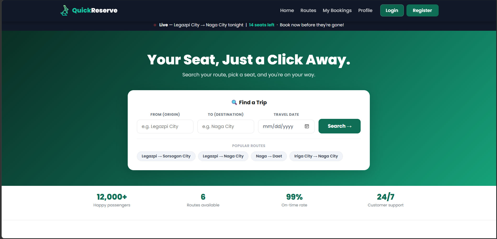

# 🚌 QuickReserve: Online Bus & Travel Booking System  

---

## 👨‍💻 Developers

- Nathaniel O. Raynada  
- Anna Mae Broma  
- Camille Bercilla  
- Mariel Odoño  
- John Edmar Bongcodin  
- Justin James Dasallas  

---

## 📌 Project Information

| Details | Description |
|--------|------------|
| 📚 Course | IT 112 – Web Systems and Technologies |
| 👨‍🏫 Instructor | Guillermo V. Red, Jr. |
| 📅 Date | March 28, 2026 |

---

## 🖤 About the Project

**QuickReserve** is a modern web-based booking platform designed to transform how passengers reserve bus tickets and manage their travel.

Instead of dealing with long queues and manual ticketing, users can enjoy a fast, convenient, and fully digital experience—from browsing schedules to confirming bookings.

💡 Built to enhance **efficiency, accessibility, and user experience** in public transportation.

---

## 🚀 Live Deployment

🔗 https://final-project-tech-vanguard-bsit2b.onrender.com  

---

## 📸 Preview



---

## 🎯 Purpose

This system provides users the ability to:

- ⚡ Reserve tickets quickly with minimal steps  
- 🚌 Explore routes and schedules in real-time  
- 💺 Select preferred seats before booking  
- 📄 Manage and monitor reservations  
- 💻 Navigate a clean and responsive interface  

---

## 👥 Users

| Role | Description |
|------|------------|
| 👤 Customer | Books tickets and manages trips |
| ⚙️ Admin | Manages routes, buses, and system data |

---

## 🚀 Features

- ✔ Secure Authentication System (JWT)  
- ✔ Route & Schedule Browsing  
- ✔ Interactive Seat Selection UI  
- ✔ Online Booking & Reservation System  
- ✔ Booking History & Status Tracking  
- ✔ Admin Dashboard Full Management Panel  
- ✔ Responsive Design (Mobile & Desktop Ready)  

---

## 🧩 Tech Stack

| Layer | Technology |
|------|------------|
| 🎨 Frontend | HTML, CSS, JavaScript |
| ⚙️ Backend | Node.js, Express |
| 🗄️ Database | MongoDB |

---

## ⚙️ Installation & Setup

### 📥 Clone the Repository

```bash
git clone https://github.com/your-username/quickreserve.git

📁 Navigate to Project Folder
cd quickreserve

📦 Install Dependencies
npm install

▶️ Run the Project
npm start

📁 Project Structure
quickreserve/
│── client/        # Frontend files
│── server/        # Backend (Node.js + Express)
│── models/        # Database models
│── routes/        # API routes
│── controllers/   # Logic handling
│── package.json
│── README.md

🧾 Final Project – Tech Vanguard BSIT2B, Live Deployment
🔗 https://final-project-tech-vanguard-bsit2b.onrender.com

👥 Group Members and Contributions
Name	Contribution
Nathaniel Raynada - Frontend developer/project Manager
Anna Mae Broma - Backend Developer
Camille Bercilla - Github Manager
Mariel Odoño - Documentation Officer
John Edmar Bongcodin - Tester/Debugger
Justine James Dasallas - Database Manager

📂 How to Clone the Project (Step-by-Step)

Follow these steps to download and run the project on your local machine:

🧾 Step 1: Install Git

Make sure Git is installed on your computer.
Download here: https://git-scm.com/

Check if Git is installed:

git --version
📥 Step 2: Open Terminal / Command Prompt

You can use:

Git Bash (recommended)
VS Code Terminal
Command Prompt
PowerShell
📌 Step 3: Go to Your Desired Folder

Choose where you want to store the project:

cd Desktop

(or any folder you prefer)

📦 Step 4: Clone the Repository

Download the project from GitHub:

git clone https://github.com/camillebercilla/final-project--Tech_Vanguard--BSIT2B.git

📁 Step 5: Enter the Project Folder
cd final-project--Tech_Vanguard--BSIT2B

▶️ Running the Project
🎨 FRONTEND
cd frontend
npm install
npm start
⚙️ BACKEND
cd backend
npm install
npm run dev

Contributions are welcome!
Feel free to fork this repository and submit a pull request.

📜 License
This project is for educational purposes only.

✨ Closing
QuickReserve is more than just a booking platform—
it’s a smarter, faster, and more efficient way to travel.
